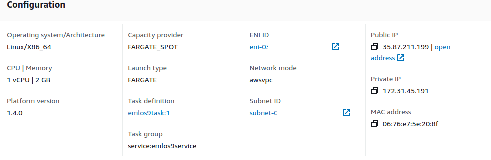

<div align="center">

# Session 9

</div>


## Introduction

In this session, we will deploy a GPT model to AWS FarGate. 


## Notes

The model has been pushed to S3 and will be downloaded from there. For the container to access the model, ECR has been granted the `AmazonS3ReadOnlyAccess` policy. 

The docker image has been pushed to ECR.


## Building the Image

```
docker build -t emlos9:gpt -f Dockerfile .
```

## Setting up ECS

- Create Cluster
    - Make sure that the Security Group has port 80 open for traffic.
- Create Role (named ECS-S3Read) for 'Elastic Container Service Task' with 'AmazonS3ReadOnlyAccess' policy
- Create Task Definition
    - In 'Task role', choose 'ECS-S3Read' role
- Once task is created, go to Deploy -> 'Create Service'
    - In 'Capacity provider', choose 'FARGATE_SPOT'


**FarGate Spot Mode**  

